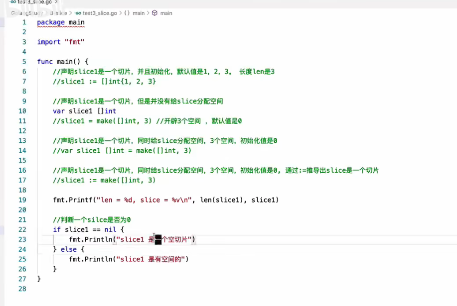
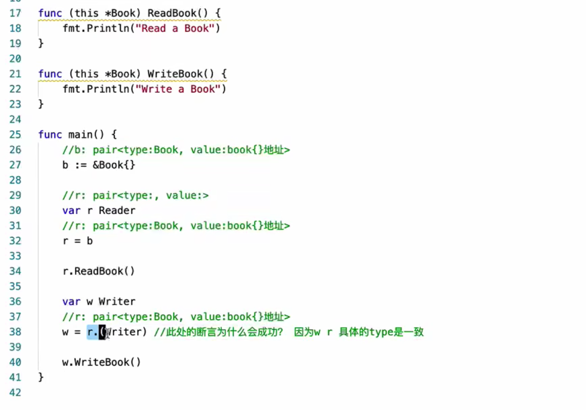
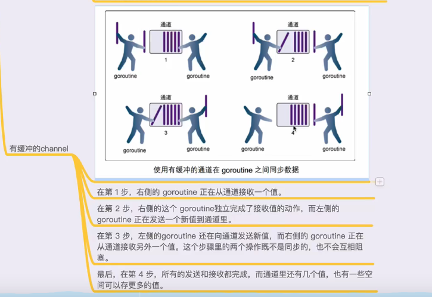
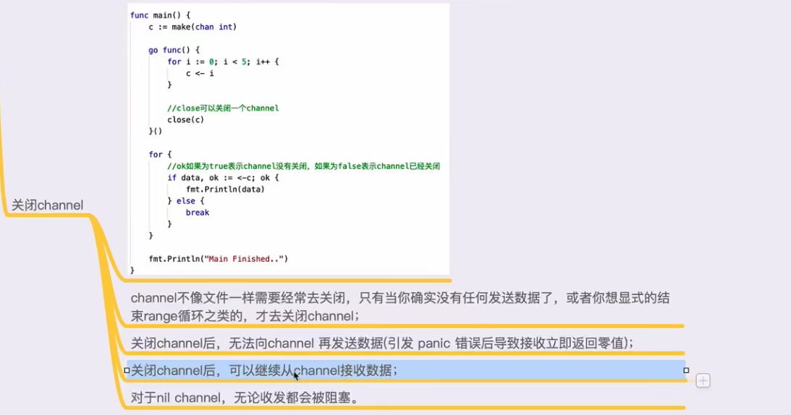
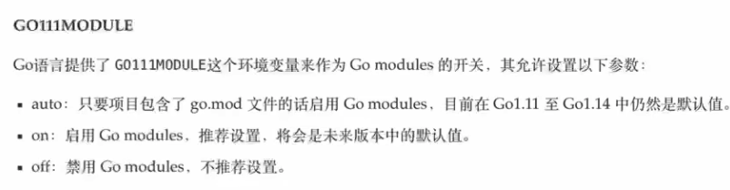
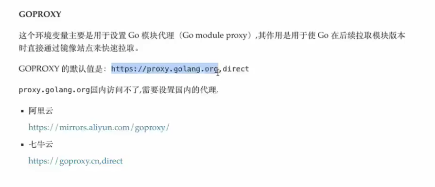

1. [打印 hello world ](./hello/hello.go)
2. [变量定义](./variable/variable.go)
3. [常量定义](./const/const.go)
4. [函数](./func/func.go)
5. [import导入包路径问题与init方法调用流程,别名导入](./import/main.go)  
     
   ├── lib1  
   │ └── lib1.go  
   ├── lib2  
   │ └── lib2.go  
   └── main.go

6. [指针](./pointer/pointer.go)  
   引用传递,传递指针
7. [defer](./defer/defer.go)
8. [数组与动态数组定义操作](./array_slice/array_slice.go)
9. [数组切片定义与操作](slice/slice.go)
   
10. [map创建使用](./map/map.go)
    1. 创建
    2. 添加修改
    3. 删除
    4. 遍历
    5. 查找
    6. 往函数传参是引用传递
11. 面向对象
    1. [声明数据类型结构体](./object/struct/struct.go)
        1. 定义结构体
        2. 修改结构体的值
        2. 往函数传参结构体默认是值传递,引用传递按照定义普通变量方式
        3. [遍历结构体](./object/reflect/reflect.go)
    2. [类的表示与封装](./object/class/class.go)
        1. 类的创建
            1. 对象实例化
            2. 类名大写开头代表其他包可以访问,小写开头代表只有本包可以访问
            2. 类名小写开头代表只有本包可以访问,大写开头代表其他包可以访问
        2. 类方法创建,形参要用指针
    3. [面向对象继承](./object/inherit/inherit.go)
        1. 继承
            1. 子类继承父类
            2. 子类方法重写父类方法
            3. 对象实例化
    4. 面向对象多态接口
        1. [接口](./object/interface/interface.go)
            1. 接口定义
            2. 接口实现
            3. 接口使用 依赖注入,一个方法的形参接收变量,变量类型是一个接口
        2. [万能类型空接口](./object/empty_interface/empty_interface.go)
            1. 类型断言,判断类型
            2. 空接口 形参中类型位置是interface{} 例如: func (arg interface{})  
    5. 反射
       1. pair<type,value>
       2. 断言成功是pair中的type相同
          
       3. [反射reflect机制用法](./object/reflect/reflect.go)
          1. 获取一个变量的类型 reflect.TypeOf(变量)
          2. 获取一个变量的值 reflect.ValueOf(变量)
          3. 获取对象类型的方法集合,循环 
          4. 获取对象类型的变量集合,循环
       4. [反射解析结构体标签Tag](./object/reflect_tag/reflect_tag.go)
          1. json标签
12. goroutine 协程
    1. [基础创建](./object/goroutine/goroutine.go) 
    2. [协程参数通信-无缓冲channel](./object/goroutine_channel/goroutine_channel.go)
               
    3. [协程参数通信-有缓冲channel](./object/goroutine_channel_huanchong/goroutine_channel_huanchong.go)
               
    4. [协程参数通信-关闭channel,判断channel状态](./object/goroutine_channel_close/goroutine_channel_close.go)
               
    5. [协程参数通信-监控多个channel状态](./object/goroutine_channel_select/goroutine_channel_select.go)
       channel传值传递,引用传递
13. 方法
    1. [小数 整数,加减乘除](./arithmetic/arithmetic.go)
    2. 加减乘除
    3. 字符串变更
    4. 字符串截取
    5. 字符串拼接
    6. 字符串替换
    7. [json字符串转对象](./object/reflect_tag/reflect_tag.go)
    8. [对象转json字符串](./object/reflect_tag/reflect_tag.go)
14. Go Module
    1. 命令 
       1. go mod init 生成go.mod文件,初始化
       2. go mod download 下载依赖的包
       3. go mod tidy 检查并修复go.mod文件
       4. go mod vendor 把依赖的包移动到vendor目录下
       5. go mod graph 查看依赖图
       6. go mod list 查看依赖列表
       7. go mod verify 校验依赖是否正确
       8. go mod why 查看依赖原因
       9. go mod edit 编辑go.mod文件
    2. go mod 环境变量 
       1. GO111MODULE
          开启go module模式  
          ```shell
           go env -w GO111MODULE=on
          ```       
       2. GOPROXY
          设置代理
          ```shell
           #七牛云
           go env -w GOPROXY=https://goproxy.cn,direct
           #阿里云
           go env -w GOPROXY=https://mirrors.aliyun.com/goproxy/,direct
           #同时设置两个代理
           go env -w GOPROXY=https://goproxy.cn,https://mirrors.aliyun.com/goproxy/,direct
          ```
       3. 私有仓库,设置后*.example.com 域名下的所有包都不会验证,不会走代理
          ```shell
              go env -w GOPRIVATE=*.example.com
          ```
       4. 初始化项目
          1. 开启go module模式~~~~
              ```shell
                  go env -w GO111MODULE=on
                    
                  ```
          2. 初始化项目
              ```shell
                 #创建项目目录不必在 $GOPATH/src 目录下,随便创建一个目录,goprojectname(项目目录名)/modules_test(模块名)
                    mkdir -p ~/goprojectname/modules_test
                 #执行Go Modules初始化 
                    cd ~/goprojectname/modules_test
                    #go mod init 跟上当前模块名称 决定import 导入的路径 , 会生成go.mod 文件
                    go mod init github.com/xxx/modules_test 
                 #下载依赖,多次执行会将依赖更新到最新版本,没有类似前端 package.json文件 语义化版本号的方式
                    go mod download
              ``` 
       5. 修改项目模块的版本依赖关系
          go mod edit -replace=老版本=新版本
          或者直接修改go.modw文件对应的版本号
       