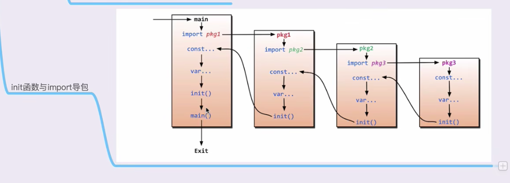

1. [打印 hello world ](./hello/hello.go)   
2. [变量定义](./variable/variable.go)  
3. [常量定义](./const/const.go)  
4. [函数](./func/func.go)  
5. [import导入包路径问题与init方法调用流程,别名导入](./import/main.go)  
      
    ├── lib1  
    │   └── lib1.go  
    ├── lib2  
    │   └── lib2.go  
    └── main.go  

6. [指针](./pointer/pointer.go)  
引用传递,传递指针  
7. [defer](./defer/defer.go)  
8. [切片](./slice/slice.go)
9. [map创建使用](./map/map.go)
   1. 创建
   2. 添加修改
   3. 删除
   4. 遍历
   5. 查找
   6. 往函数传参是引用传递
10. 面向对象
    1. [声明数据类型结构体](./object/struct/struct.go)
       1. 定义结构体
       2. 修改结构体的值
       2. 往函数传参结构体默认是值传递,引用传递按照定义普通变量方式
       3. 遍历结构体
    2. [类的表示与封装](./object/class/class.go)
       1. 类的创建
          1. 对象实例化
          2. 类名大写开头代表其他包可以访问,小写开头代表只有本包可以访问
          2. 类名小写开头代表只有本包可以访问,大写开头代表其他包可以访问
       2. 类方法创建,形参要用指针
    3. [面向对象继承](./object/inherit/inherit.go)
       1. 继承
          1. 子类继承父类
          2. 子类方法重写父类方法
          3. 对象实例化
      