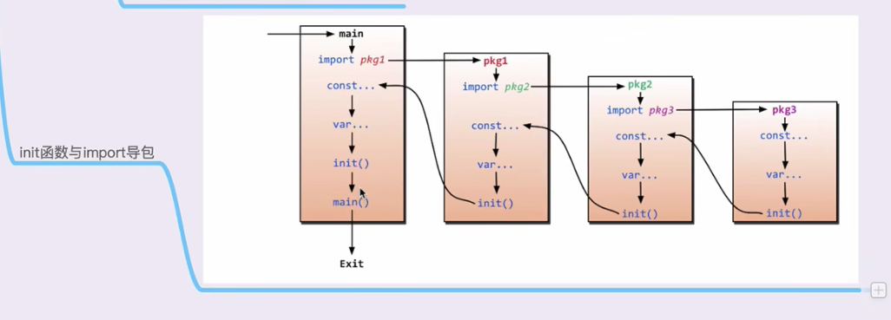

1.[打印 hello world ](./hello/hello.go)   
2.[变量定义](./variable/variable.go)  
3.[常量定义](./const/const.go)  
3.[函数](./func/func.go)  
4.[import导入包路径问题与init方法调用流程,别名导入](./import/main.go)  
      
    ├── lib1  
    │   └── lib1.go  
    ├── lib2  
    │   └── lib2.go  
    └── main.go  

5.[指针](./pointer/pointer.go)
    引用传递,传递指针
6. [defer](./defer/defer.go)
7. [切片](./slice/slice.go)
      